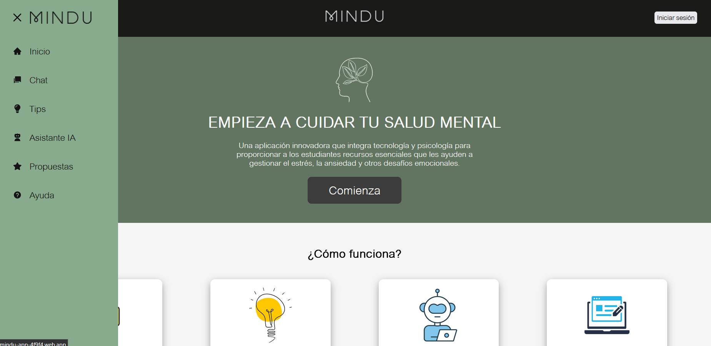
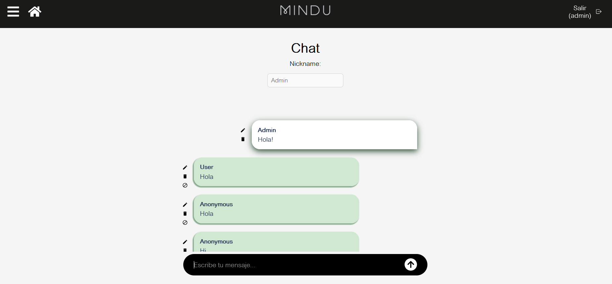
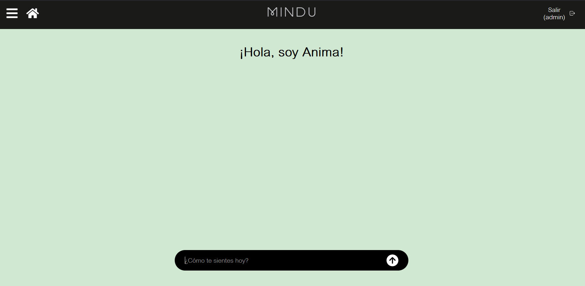
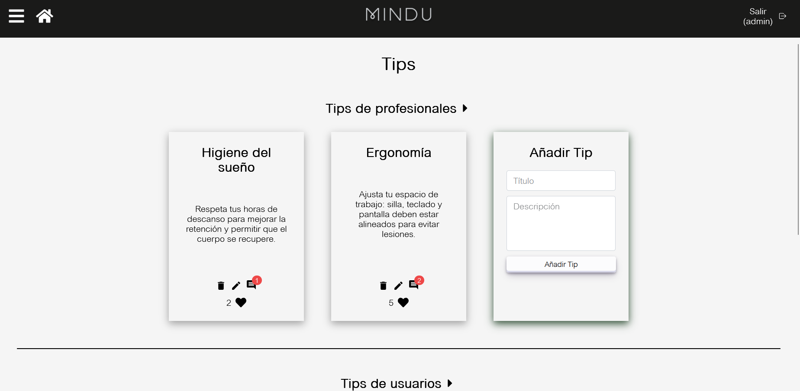
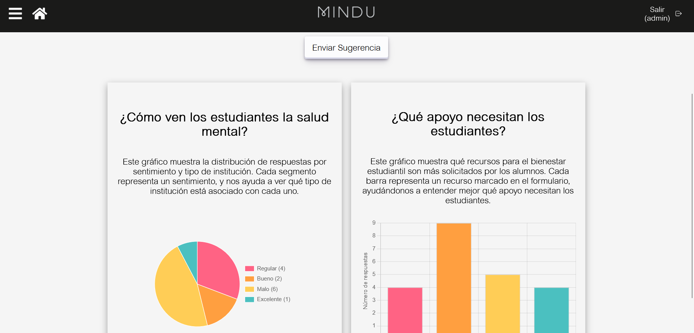
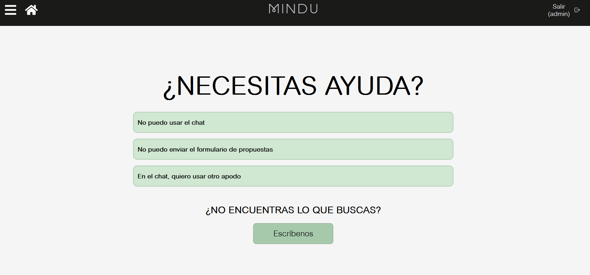

# Mental Health Application Project

## Overview

This **Mental Health Application** is a comprehensive platform that combines **technology, psychology, and student engagement** to provide real tools for emotional support.

The app includes:

- **Anonymous Chat**: Share your thoughts freely without worrying about identity.
- **Wellness Tips**: Discover strategies from professionals and the community.
- **Anima**: An AI Assistant offering conversational support.
- **Mental Health Articles**: Learn more about emotional well-being.
- **Proposals Form**: Students can suggest improvements and view results in interactive charts.

Additionally, it allows **administrators to manage articles and dynamic content**, all connected to a real-time database.

---

## Application Preview

### Main Page



---

### Anonymous Chat

Users can communicate in a safe, anonymous environment designed to encourage openness and emotional expression.



---

### Anima – AI Assistant

An AI-powered assistant that provides conversational emotional support and guidance.



---

### Wellness Tips

Practical mental health tips provided by professionals and the student community.



---

### Proposals & Interactive Charts

Students can submit suggestions for improvement and visualize results through dynamic charts.



---

### Help & Support Section

Additional guidance and resources for users who need structured assistance.



---

## Recognition

This project was awarded **4th place at the Premios Don Bosco**, one of the most prestigious technology innovation contests. This recognition showcases the project’s impact and potential for positively influencing mental health management in educational settings.

---

## Key Features

- Real-time data management
- Dynamic content creation and management
- Interactive charts for insights
- AI-powered emotional support assistant
- Anonymous communication system

---

## Getting Started

To get started with the project locally:

### Prerequisites

- Node.js
- npm

### Installation

```bash
npm install
npm run dev
```
